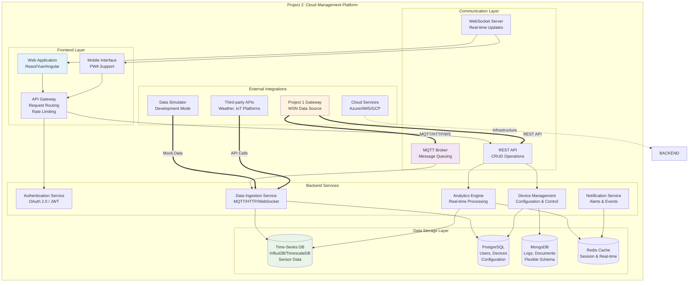
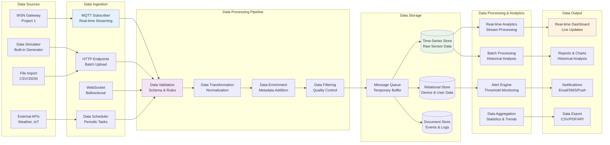
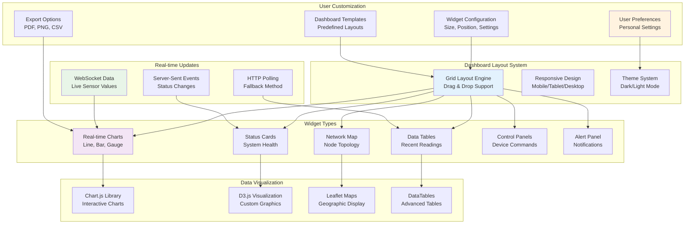
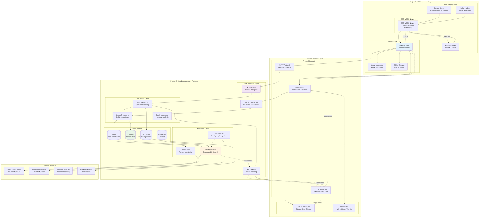
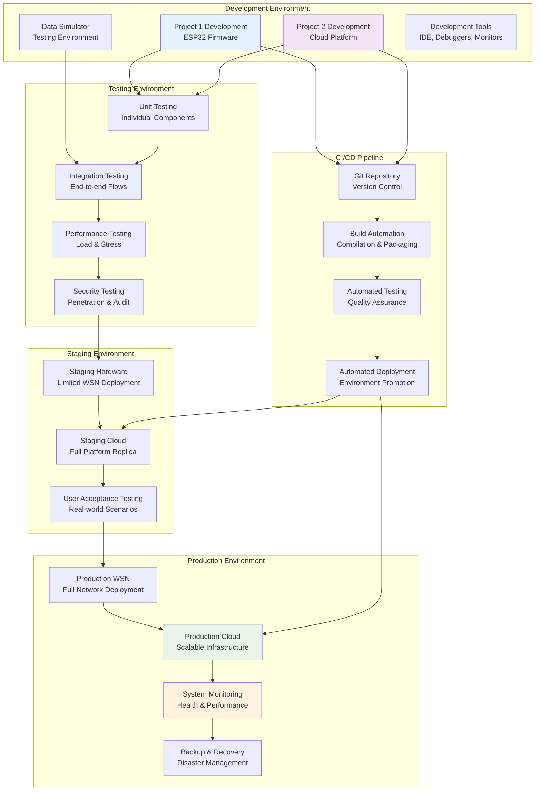

# Project001# โครงงานที่ 2: แนวทางการพัฒนาแพลตฟอร์มบริหารจัดการ WSN

## ชื่อโครงงาน

### ชื่อภาษาไทย
แพลตฟอร์มบริหารจัดการเครือข่ายเซ็นเซอร์ไร้สาย (WSN) บนคลาวด์สำหรับเซ็นเซอร์และอุปกรณ์ควบคุมอเนกประสงค์

### ชื่อภาษาอังกฤษ
Cloud-Based Management Platform for Versatile Sensor and Actuator Wireless Sensor Networks (WSN)

## บทคัดย่อ (Abstract)

โครงงานนี้เป็นการพัฒนาแพลตฟอร์มบริหารจัดการระบบเครือข่ายเซ็นเซอร์ไร้สาย (WSN) บนคลาวด์ที่ทำหน้าที่เป็นศูนย์กลางในการรวบรวม จัดเก็บ วิเคราะห์ และแสดงผลข้อมูลจากเซ็นเซอร์ต่างๆ รวมถึงการควบคุมอุปกรณ์ Actuator ผ่านเว็บอินเทอร์เฟซ 

ระบบได้รับการออกแบบให้มีความยืดหยุ่นสูง สามารถรองรับข้อมูลจากแหล่งต่างๆ ไม่ว่าจะเป็นเครือข่าย WSN จริง หรือข้อมูลจำลองสำหรับการทดสอบ โดยใช้เทคโนโลยีคลาวด์สมัยใหม่และมาตรฐานการสื่อสารที่เป็นที่ยอมรับ

แพลตฟอร์มนี้สามารถทำงานแบบ Standalone หรือเชื่อมโยงกับระบบ WSN ที่มีอยู่ได้ ทำให้เหมาะสำหรับการใช้งานในหลากหลายสถานการณ์และการประยุกต์ใช้ในงานวิจัยและพัฒนาต่อไป

## 1. วัตถุประสงค์

### วัตถุประสงค์หลัก

1. **พัฒนาระบบรวบรวมและจัดเก็บข้อมูล**
   - สร้างระบบรับข้อมูลแบบเรียลไทม์จากแหล่งต่างๆ (WSN จริง หรือ Simulator)
   - จัดเก็บข้อมูลลงฐานข้อมูลบนคลาวด์อย่างมีประสิทธิภาพ
   - รองรับการรับข้อมูลจากหลากหลายโปรโตคอล (MQTT, HTTP, WebSocket)

2. **พัฒนาแพลตฟอร์มการแสดงผลและวิเคราะห์ข้อมูล**
   - สร้าง Dashboard แสดงสถานะเครือข่าย และข้อมูลเซ็นเซอร์แบบเรียลไทม์
   - พัฒนาระบบการแสดงผลกราฟและแนวโน้มข้อมูล
   - สร้างเครื่องมือวิเคราะห์ข้อมูลเบื้องต้น

3. **สร้างระบบควบคุมและจัดการระยะไกล**
   - พัฒนาส่วนติดต่อผู้ใช้สำหรับควบคุมอุปกรณ์ Actuator
   - สร้างระบบการตั้งค่าพารามิเตอร์อุปกรณ์ระยะไกล
   - ออกแบบระบบการจัดการสิทธิ์ผู้ใช้

4. **สร้างระบบการแจ้งเตือนและการเฝ้าระวัง**
   - พัฒนาระบบแจ้งเตือนเมื่อค่าเซ็นเซอร์เกินเกณฑ์ที่กำหนด
   - สร้างระบบ Monitoring สำหรับสถานะของอุปกรณ์
   - ออกแบบระบบ Logging และ Audit Trail

5. **ออกแบบสถาปัตยกรรมที่ยืดหยุ่นและปลอดภัย**
   - สร้างระบบที่สามารถทำงานแบบ Standalone หรือเชื่อมต่อกับระบบภายนอก
   - ใช้มาตรฐานความปลอดภัยสำหรับการเข้าถึงข้อมูลและการควบคุมระบบ
   - ออกแบบให้รองรับการขยายระบบในอนาคต

### วัตถุประสงค์เฉพาะ

1. สร้างระบบที่ทำงานได้ทั้งกับข้อมูลจำลอง (Mockup) และข้อมูลจากฮาร์ดแวร์จริง
2. พัฒนา API ที่เป็นมาตรฐานสำหรับการเชื่อมต่อกับระบบภายนอก
3. ทดสอบประสิทธิภาพของระบบในการจัดการข้อมูลจำนวนมาก
4. สร้างเอกสารและคู่มือการใช้งานที่ครบถ้วน

## 2. องค์ประกอบหลักและแนวคิดการออกแบบ

### 2.1 Cloud Platform Architecture Overview



### 2.2 Data Pipeline และ Processing Architecture



### 2.3 ความเป็นอิสระและความยืดหยุ่นของระบบ

**หลักการออกแบบ (Design Principles)**
- **Modularity:** ระบบถูกออกแบบเป็นโมดูลที่สามารถทำงานแยกอิสระ
- **Interoperability:** รองรับมาตรฐานการสื่อสารที่หลากหลาย
- **Scalability:** สามารถขยายขนาดได้ตามความต้องการ
- **Fault Tolerance:** ทำงานต่อได้แม้ส่วนอื่นของระบบมีปัญหา

**แหล่งข้อมูลที่รองรับ (Data Sources)**

*ระบบ WSN จริง (Primary Integration):*
- การเชื่อมต่อกับ Gateway ของโครงงานที่ 1 (หากมี)
- รองรับโปรโตคอล MQTT, HTTP REST API, WebSocket
- รับข้อมูลตาม Format ที่กำหนดไว้ในโครงงานที่ 1

*ระบบจำลอง (Fallback/Development Mode):*
- **Data Generator/Simulator:** สร้างข้อมูลเซ็นเซอร์จำลองแบบเรียลไทม์
- **File Import:** นำเข้าข้อมูลจากไฟล์ CSV/JSON
- **Manual Input:** การป้อนข้อมูลด้วยตนเองสำหรับทดสอบ
- **Third-party APIs:** เชื่อมต่อกับข้อมูลจากแหล่งภายนอก (เช่น Weather API)

*อุปกรณ์ IoT อื่นๆ:*
- Arduino/Raspberry Pi ที่เชื่อมต่อโดยตรง
- เซ็นเซอร์ที่ใช้ Wi-Fi/Bluetooth
- อุปกรณ์ที่รองรับ MQTT หรือ HTTP

### 2.2 Gateway Interface และ Data Ingestion

**การออกแบบ Interface ที่ยืดหยุ่น**

*การเชื่อมต่อกับโครงงานที่ 1 (หากพร้อมใช้งาน):*
- รับข้อมูลผ่าน MQTT Topics ตามที่กำหนดในโครงงานที่ 1
- Support การรับ JSON Payload ตามรูปแบบที่ตกลงกัน
- ระบบ Health Check สำหรับตรวจสอบสถานะการเชื่อมต่อ

*ระบบ Data Ingestion หลากหลายช่องทาง:*

**MQTT Broker Integration**
- Support MQTT v3.1.1 และ v5.0
- Authentication ด้วย Username/Password หรือ Certificate
- Topic Structure ที่ยืดหยุ่น (เช่น `sensors/{node_id}/{sensor_type}`)
- QoS Level 0, 1, 2 ตามความต้องการ

**HTTP REST API Endpoints**
```
POST /api/v1/sensors/data
POST /api/v1/actuators/commands
GET  /api/v1/nodes/{node_id}/status
```

**WebSocket สำหรับ Real-time Communication**
- Bidirectional communication
- Real-time command และ response
- Event-driven architecture

**Data Simulator/Generator**
- **Built-in Simulator:** สร้างข้อมูลเซ็นเซอร์จำลอง (อุณหภูมิ, ความชื้น, แสง, etc.)
- **Configurable Patterns:** กำหนดรูปแบบข้อมูลได้ (สุ่ม, ตามรอบ, ตามเงื่อนไข)
- **Load Testing:** จำลองข้อมูลจำนวนมากสำหรับทดสอบประสิทธิภาพ

**การจัดการข้อมูลขาเข้า (Data Processing Pipeline)**
1. **Data Validation:** ตรวจสอบ Format และ Data Type
2. **Data Transformation:** แปลงข้อมูลให้เป็น Standard Format
3. **Data Enrichment:** เพิ่มข้อมูล Metadata (Timestamp, Location, etc.)
4. **Data Routing:** ส่งข้อมูลไปยัง Storage และ Real-time Processing

### 2.3 Backend Server (Cloud-Native Architecture)

**การออกแบบสถาปัตยกรรม**

*Cloud Platform Options:*
- **Microsoft Azure:** IoT Hub, App Service, SQL Database, SignalR
- **Amazon AWS:** IoT Core, EC2, RDS, API Gateway
- **Google Cloud:** IoT Core, App Engine, Cloud SQL, Pub/Sub
- **Self-hosted:** Docker containers, Kubernetes

*Microservices Architecture:*

**Data Ingestion Service**
- รับข้อมูลจากแหล่งต่างๆ (MQTT, HTTP, WebSocket)
- Data validation และ transformation
- Message queuing สำหรับการประมวลผลแบบ asynchronous

**Data Storage Service**
- การจัดเก็บข้อมูลแบบ Time-series
- Data partitioning และ indexing
- Data retention policy และ archiving

**Real-time Processing Service**
- Stream processing สำหรับข้อมูลเรียลไทม์
- Alert และ notification triggering
- Data aggregation และ analytics

**Device Management Service**
- จัดการข้อมูลอุปกรณ์และ configuration
- Command routing และ delivery tracking
- Device status monitoring

**API Gateway Service**
- RESTful API endpoints
- Authentication และ authorization
- Rate limiting และ request throttling
- API documentation และ versioning

**Communication Protocols**

*MQTT Integration:*
```
Topics Structure:
- sensors/{location}/{node_id}/{sensor_type}/data
- actuators/{location}/{node_id}/{actuator_type}/command
- nodes/{node_id}/status
- system/alerts
```

*REST API Design:*
```
# Sensor Data
GET    /api/v1/sensors
POST   /api/v1/sensors/{sensor_id}/data
GET    /api/v1/sensors/{sensor_id}/data?from={timestamp}&to={timestamp}

# Device Management
GET    /api/v1/devices
GET    /api/v1/devices/{device_id}
PUT    /api/v1/devices/{device_id}/config
POST   /api/v1/devices/{device_id}/commands

# Real-time Data
WebSocket: /ws/realtime
SignalR Hub: /hub/sensor-data
```

**Business Logic Components**

*Data Processing Pipeline:*
1. **Input Validation:** ตรวจสอบ data format และ business rules
2. **Data Enrichment:** เพิ่ม metadata และ derived values
3. **Analytics Processing:** คำนวณ statistics และ trends
4. **Alert Processing:** ตรวจสอบ threshold และ trigger alerts
5. **Storage Optimization:** บีบอัดและ partition data

*Command Processing:*
1. **Authorization Check:** ตรวจสอบสิทธิ์ของผู้ใช้
2. **Command Validation:** ตรวจสอบความถูกต้องของคำสั่ง
3. **Device Availability:** ตรวจสอบสถานะของอุปกรณ์
4. **Command Delivery:** ส่งคำสั่งและติดตามสถานะ
5. **Response Handling:** จัดการ feedback จากอุปกรณ์

### 2.4 ฐานข้อมูล (Database Architecture)

**การออกแบบ Multi-Database Strategy**

*Time-Series Database (สำหรับข้อมูลเซ็นเซอร์):*
- **InfluxDB:** เหมาะสำหรับข้อมูล time-series ขนาดใหญ่
- **Azure Time Series Insights** หรือ **AWS Timestream**
- **TimescaleDB:** PostgreSQL extension สำหรับ time-series data
- ข้อดี: การ query ที่รวดเร็ว, data compression, retention policies

*Relational Database (สำหรับข้อมูลโครงสร้าง):*
- **PostgreSQL:** สำหรับข้อมูล metadata, user management, device registry
- **SQL Server:** สำหรับระบบ enterprise ขนาดใหญ่
- ใช้เก็บ: ข้อมูลผู้ใช้, การตั้งค่าระบบ, audit logs

*NoSQL Database (สำหรับข้อมูลแบบยืดหยุ่น):*
- **MongoDB:** สำหรับเก็บ configuration และ unstructured data
- **Azure Cosmos DB** หรือ **AWS DynamoDB**
- ใช้เก็บ: device profiles, complex configurations, JSON documents

**Database Schema Design**

*Relational Tables:*
```sql
-- Users and Authentication
CREATE TABLE users (
    user_id UUID PRIMARY KEY,
    username VARCHAR(50) UNIQUE,
    email VARCHAR(100),
    password_hash VARCHAR(255),
    role VARCHAR(20),
    created_at TIMESTAMP,
    last_login TIMESTAMP
);

-- Device Registry
CREATE TABLE devices (
    device_id VARCHAR(50) PRIMARY KEY,
    device_type VARCHAR(20),
    location VARCHAR(100),
    status VARCHAR(20),
    last_seen TIMESTAMP,
    metadata JSONB,
    created_at TIMESTAMP
);

-- Sensor Types
CREATE TABLE sensor_types (
    sensor_type_id VARCHAR(50) PRIMARY KEY,
    name VARCHAR(100),
    unit VARCHAR(20),
    min_value DECIMAL,
    max_value DECIMAL,
    accuracy DECIMAL
);
```

*Time-Series Schema:*
```sql
-- Sensor Readings (InfluxDB/TimescaleDB)
CREATE TABLE sensor_readings (
    time TIMESTAMPTZ NOT NULL,
    device_id VARCHAR(50),
    sensor_type VARCHAR(50),
    value DECIMAL,
    quality INTEGER,
    metadata JSONB
);

-- System Events
CREATE TABLE system_events (
    time TIMESTAMPTZ NOT NULL,
    event_type VARCHAR(50),
    source VARCHAR(100),
    severity VARCHAR(20),
    message TEXT,
    details JSONB
);
```

*Command and Control:*
```sql
-- Commands History
CREATE TABLE commands (
    command_id UUID PRIMARY KEY,
    device_id VARCHAR(50),
    command_type VARCHAR(50),
    payload JSONB,
    status VARCHAR(20),
    sent_at TIMESTAMP,
    executed_at TIMESTAMP,
    user_id UUID REFERENCES users(user_id)
);
```

**Data Management Strategies**

*Data Retention Policies:*
- **Real-time data:** 24 ชั่วโมง ใน memory cache
- **Detailed data:** 30 วัน ใน high-speed storage
- **Aggregated data:** 1 ปี ใน standard storage
- **Historical data:** 5+ ปี ใน cold storage/archive

*Data Backup และ Recovery:*
- Automated daily backups
- Cross-region replication
- Point-in-time recovery
- Disaster recovery procedures

### 2.5 Frontend / User Interface (Modern Web Application)

**การออกแบบ UI/UX**

*Technology Stack Options:*
- **React.js + TypeScript:** สำหรับ SPA ที่ responsive
- **Vue.js + Nuxt.js:** สำหรับ full-stack web application
- **Angular:** สำหรับ enterprise-grade applications
- **Svelte/SvelteKit:** สำหรับ performance-focused applications

*UI Component Libraries:*
- **Material-UI / Ant Design:** สำหรับ professional interface
- **Chart.js / D3.js:** สำหรับการ visualization
- **React-Grid-Layout:** สำหรับ customizable dashboard

**หน้าจอและฟีเจอร์หลัก**

### 2.6 User Interface Architecture

```mermaid
graph TB
    subgraph "Frontend Application Architecture"
        subgraph "User Interface Layer"
            LOGIN[Login Page<br/>Authentication]
            DASHBOARD[Main Dashboard<br/>Real-time Overview]
            DEVICES[Device Management<br/>Configuration & Control]
            ANALYTICS[Analytics & Reports<br/>Data Visualization]
            ADMIN[System Administration<br/>User & Settings Management]
        end
        
        subgraph "Component Architecture"
            LAYOUT[Layout Components<br/>Navigation, Header, Sidebar]
            WIDGETS[Dashboard Widgets<br/>Charts, Gauges, Cards]
            FORMS[Form Components<br/>Configuration, Settings]
            TABLES[Data Tables<br/>Device Lists, Logs]
            MODALS[Modal Dialogs<br/>Commands, Confirmations]
        end
        
        subgraph "State Management"
            STORE[Global State Store<br/>Redux/Vuex/Pinia]
            CACHE[Local Cache<br/>Recent Data]
            SESSION[Session Storage<br/>User Preferences]
        end
        
        subgraph "Communication Layer"
            HTTP_CLIENT[HTTP Client<br/>REST API Calls]
            WS_CLIENT[WebSocket Client<br/>Real-time Updates]
            AUTH_MODULE[Auth Module<br/>Token Management]
        end
    end
    
    subgraph "Real-time Data Flow"
        SENSOR_STREAM[Sensor Data Stream]
        COMMAND_STREAM[Command Stream]
        ALERT_STREAM[Alert Stream]
        STATUS_STREAM[Status Updates]
        
        SENSOR_STREAM --> WIDGETS
        COMMAND_STREAM --> FORMS
        ALERT_STREAM --> NOTIFICATIONS[Notification Component]
        STATUS_STREAM --> INDICATORS[Status Indicators]
    end
    
    %% User Flow Connections
    LOGIN --> DASHBOARD
    DASHBOARD --> DEVICES
    DASHBOARD --> ANALYTICS
    DASHBOARD --> ADMIN
    
    %% Component Relationships
    LAYOUT --> DASHBOARD
    WIDGETS --> DASHBOARD
    FORMS --> DEVICES
    TABLES --> DEVICES
    MODALS --> DEVICES
    
    %% State Management
    STORE --> WIDGETS
    STORE --> FORMS
    CACHE --> TABLES
    SESSION --> LAYOUT
    
    %% Communication
    HTTP_CLIENT --> BACKEND[Backend Services]
    WS_CLIENT --> REALTIME[Real-time Services]
    AUTH_MODULE --> LOGIN
    
    style LOGIN fill:#e3f2fd
    style DASHBOARD fill:#f3e5f5
    style WIDGETS fill:#e8f5e8
    style WS_CLIENT fill:#fff3e0
```



### 2.7 Dashboard และ Visualization Architecture



#### 2.7.1 Dashboard หลัก (Main Dashboard)

**Network Overview**
- **Real-time Status Map:** แสดงโหนดทั้งหมดบนแผนที่หรือ topology diagram
- **System Health Indicators:** สถานะระบบโดยรวม (online/offline devices, alerts)
- **Key Metrics Summary:** สรุปข้อมูลสำคัญ (อุณหภูมิเฉลี่ย, การใช้พลังงาน, etc.)
- **Recent Alerts Panel:** แจ้งเตือนล่าสุดและสถานะความสำคัญ

**Customizable Widgets**
- Drag-and-drop dashboard components
- Configurable chart types และ time ranges
- Personal dashboard layouts ต่อผู้ใช้
- Export และ sharing capabilities

#### 2.5.2 Device Management Interface

**Device List และ Grid View**
- **Filterable Device List:** ค้นหาและกรองอุปกรณ์ตามเกณฑ์ต่างๆ
- **Batch Operations:** เลือกหลายอุปกรณ์สำหรับการดำเนินการพร้อมกัน
- **Device Status Indicators:** สัญญาณไฟสถานะ (เขียว/เหลือง/แดง)
- **Quick Actions:** ปุ่มสำหรับการดำเนินการทั่วไป

**Device Detail Pages**
- **Real-time Sensor Readings:** ค่าปัจจุบันจากเซ็นเซอร์แต่ละตัว
- **Historical Data Charts:** กราฟแสดงแนวโน้มข้อมูลย้อนหลัง
- **Device Configuration:** การตั้งค่าและพารามิเตอร์ของอุปกรณ์
- **Maintenance Log:** ประวัติการบำรุงรักษาและการอัปเดต

#### 2.5.3 Control and Command Interface

**Actuator Control Panels**
- **Real-time Control Widgets:** ปุ่ม, slider, input fields สำหรับควบคุม
- **Scheduled Commands:** การกำหนดเวลาสำหรับคำสั่งอัตโนมัติ
- **Batch Commands:** ส่งคำสั่งไปยังหลายอุปกรณ์พร้อมกัน
- **Command History:** ประวัติคำสั่งที่ส่งไปและผลลัพธ์

**Configuration Management**
- **Remote Parameter Setting:** การตั้งค่าพารามิเตอร์ระยะไกล
- **Calibration Tools:** เครื่องมือสำหรับปรับเทียบเซ็นเซอร์
- **Firmware Update Management:** การจัดการการอัปเดต firmware
- **Backup และ Restore:** การสำรองและกู้คืนการตั้งค่า

#### 2.5.4 Data Analytics และ Reporting

**Advanced Charting และ Visualization**
- **Multi-sensor Correlation Charts:** เปรียบเทียบข้อมูลจากหลายเซ็นเซอร์
- **Time-series Analysis:** การวิเคราะห์แนวโน้มข้อมูลตามเวลา
- **Statistical Summary Reports:** สรุปทางสถิติ (min, max, average, std dev)
- **Export Functions:** ส่งออกข้อมูลเป็น PDF, Excel, CSV

**Alert และ Notification Management**
- **Threshold Configuration:** ตั้งค่าเกณฑ์การแจ้งเตือน
- **Multi-channel Notifications:** อีเมล, SMS, Push notifications
- **Alert Escalation Rules:** กฎการส่งต่อการแจ้งเตือน
- **Notification History:** ประวัติการแจ้งเตือนทั้งหมด

#### 2.5.5 System Administration

**User Management**
- **Role-based Access Control:** การจัดการสิทธิ์ตามบทบาท
- **User Activity Logging:** บันทึกการใช้งานของผู้ใช้
- **Session Management:** การจัดการ session และ security
- **API Key Management:** การจัดการ API keys สำหรับ third-party

**System Configuration**
- **Global Settings:** การตั้งค่าระบบโดยรวม
- **Integration Settings:** การตั้งค่าการเชื่อมต่อกับระบบภายนอก
- **Data Retention Policies:** นโยบายการเก็บข้อมูล
- **Backup และ Recovery Tools:** เครื่องมือสำรองและกู้คืนข้อมูล

**Mobile Responsiveness**
- Progressive Web App (PWA) support
- Touch-friendly interface สำหรับ tablet และ mobile
- Offline capability สำหรับฟีเจอร์พื้นฐาน
- Push notifications สำหรับ mobile devices

### 2.6 การรักษาความปลอดภัย (Security Framework)

**Multi-Layer Security Architecture**

*Application Security:*
- **Authentication:** OAuth 2.0, OpenID Connect, Multi-Factor Authentication
- **Authorization:** Role-Based Access Control (RBAC), Resource-based permissions
- **Session Management:** JWT tokens, secure session handling, token refresh
- **API Security:** Rate limiting, input validation, SQL injection prevention

*Data Security:*
- **Encryption in Transit:** TLS 1.3 สำหรับ HTTPS/WSS, MQTT over TLS
- **Encryption at Rest:** Database encryption, file system encryption
- **Data Masking:** Sensitive data protection ใน logs และ exports
- **Privacy Controls:** GDPR compliance, data anonymization

*Infrastructure Security:*
- **Network Security:** Firewalls, VPN access, network segmentation
- **Container Security:** Docker image scanning, runtime protection
- **Cloud Security:** IAM policies, security groups, audit logging
- **Monitoring:** Intrusion detection, security event logging

**Security Implementation Details**

```javascript
// JWT Token Structure
{
  "sub": "user123",
  "name": "John Doe",
  "roles": ["operator", "viewer"],
  "permissions": ["read:sensors", "write:actuators"],
  "exp": 1642781234
}

// RBAC Matrix
Roles:
- Admin: Full system access
- Operator: Device control + monitoring
- Viewer: Read-only access
- Guest: Limited dashboard access
```

## 3. การพัฒนาระบบแบบอิสระ (Independent Development Strategy)

### 3.1 Dual-Mode Development Approach

**Mode 1: Standalone Development (ระยะแรก)**
- พัฒนาระบบให้ทำงานได้แบบ standalone โดยไม่ต้องพึ่งพาโครงงานที่ 1
- ใช้ Built-in Data Simulator สำหรับสร้างข้อมูลทดสอบ
- พัฒนา API endpoints ที่รองรับข้อมูลจากแหล่งต่างๆ
- ทดสอบฟีเจอร์ทั้งหมดด้วยข้อมูลจำลอง

**Mode 2: Integration Mode (เมื่อโครงงานที่ 1 พร้อม)**
- เชื่อมต่อกับ Gateway ของโครงงานที่ 1
- ใช้ข้อมูลจริงจากระบบ WSN
- Validate การทำงานร่วมกัน
- Fine-tuning และ optimization

### 3.2 Data Simulation และ Testing Framework

**Built-in Data Generator**
```javascript
// Sensor Data Simulator Configuration
const sensorSimulator = {
  devices: [
    {
      id: "NODE_001",
      type: "ENVIRONMENTAL",
      sensors: [
        {
          type: "temperature",
          range: [20, 35],
          pattern: "sine_wave",
          noise: 0.5
        },
        {
          type: "humidity", 
          range: [40, 80],
          pattern: "random_walk",
          noise: 2.0
        }
      ],
      location: "Building_A_Floor_1"
    }
  ],
  updateInterval: 5000, // 5 seconds
  networkLatency: [50, 200] // ms
};
```

**Mock Hardware Integration**
- สร้าง Virtual Devices ที่จำลองพื้นหาพฤติกรรมของโหนดจริง
- Command Response Simulation
- Network failure และ recovery scenarios
- Battery level และ signal strength simulation

**Test Data Sets**
- Historical data samples สำหรับทดสอบการแสดงผล
- Extreme value scenarios สำหรับทดสอบ alert system
- High-volume data สำหรับ performance testing
- Edge cases และ error conditions

### 3.3 Integration Points และ Compatibility

### 3.4 Complete System Integration Architecture



### 3.5 Deployment และ DevOps Architecture



**Standard Communication Protocols**
```json
// Standard Message Format (Compatible with Project 1)
{
  "message_id": "uuid",
  "timestamp": "ISO8601",
  "device_id": "NODE_001",
  "message_type": "SENSOR_DATA",
  "payload": {
    "sensor_type": "temperature",
    "value": 25.6,
    "unit": "C",
    "quality": "good"
  },
  "metadata": {
    "battery_level": 85,
    "signal_strength": -45
  }
}
```

**Flexible Configuration System**
- Environment-based configuration (dev, staging, production)
- Feature flags สำหรับ enable/disable ฟีเจอร์ต่างๆ
- Dynamic data source switching
- Protocol adapter pattern สำหรับรองรับโปรโตคอลใหม่

**Fallback Mechanisms**
- Automatic fallback to simulation mode เมื่อไม่มีข้อมูลจริง
- Graceful degradation เมื่อบางส่วนของระบบไม่พร้อม
- Offline mode สำหรับการทำงานในสภาพเครือข่ายไม่เสถียร
- Data replay สำหรับ testing และ debugging

## 4. ขั้นตอนการดำเนินงาน (Development Roadmap)

### Phase 1: Foundation และ Architecture (สัปดาห์ที่ 1-3)

**4.1 การออกแบบระบบและเลือกเทคโนโลยี**
- วิเคราะห์ requirements และออกแบบ system architecture
- เลือก cloud platform และ technology stack
- ออกแบบ database schema และ API structure
- สร้าง development environment และ CI/CD pipeline

**4.2 การสร้าง Data Simulator และ Testing Framework**
- พัฒนา built-in data generator สำหรับจำลองข้อมูลเซ็นเซอร์
- สร้าง mock hardware interfaces
- ออกแบบ test data sets และ scenarios
- ทดสอบ data generation และ validation

### Phase 2: Backend Development (สัปดาห์ที่ 4-8)

**4.3 พัฒนา Core Backend Services**
- สร้าง microservices architecture
- พัฒนา data ingestion service (MQTT, HTTP, WebSocket)
- สร้าง database layer และ ORM
- Implement authentication และ authorization system

**4.4 API Development และ Business Logic**
- สร้าง RESTful APIs สำหรับ CRUD operations
- พัฒนา real-time communication (WebSocket/SignalR)
- Implement alert และ notification system
- สร้าง data processing pipeline

**4.5 การทดสอบ Backend**
- Unit testing สำหรับ individual services
- Integration testing สำหรับ API endpoints
- Performance testing กับข้อมูลจำลองขนาดใหญ่
- Security testing และ vulnerability assessment

### Phase 3: Frontend Development (สัปดาห์ที่ 9-13)

**4.6 สร้าง Frontend Framework**
- Set up modern web framework (React/Vue/Angular)
- ออกแบบ UI/UX และ component library
- สร้าง responsive layout และ navigation
- Implement authentication flow

**4.7 พัฒนา Main Dashboard และ Visualization**
- สร้าง main dashboard ด้วย real-time widgets
- พัฒนา charting และ data visualization components
- Implement device management interface
- สร้าง configuration และ settings pages

**4.8 Control และ Command Interface**
- พัฒนา actuator control panels
- สร้าง command history และ scheduling
- Implement batch operations
- การทดสอบ user interface

### Phase 4: Integration และ Advanced Features (สัปดาห์ที่ 14-16)

**4.9 System Integration**
- รวม frontend กับ backend services
- ทดสอบ end-to-end workflows
- Integration กับ external systems (ถ้ามี)
- Performance optimization

**4.10 Advanced Features Development**
- สร้าง advanced analytics และ reporting
- พัฒนา mobile-responsive interface
- Implement export และ backup features
- การตั้งค่า production deployment

**4.11 Project 1 Integration (เมื่อพร้อม)**
- *หากโครงงานที่ 1 พร้อม:*
  - การเชื่อมต่อกับ Gateway จริง
  - Validation ข้อมูลจากระบบ WSN จริง
  - Fine-tuning สำหรับ real-world scenarios
- *หากโครงงานที่ 1 ไม่พร้อม:*
  - Continue ด้วย advanced simulation
  - การเตรียม integration points
  - Documentation สำหรับ future integration

### Phase 5: Testing, Optimization และ Documentation (สัปดาห์ที่ 17-20)

**4.12 Comprehensive Testing**
- System integration testing
- User acceptance testing
- Performance และ scalability testing
- Security audit และ penetration testing

**4.13 Optimization และ Production Readiness**
- Performance optimization
- Security hardening
- Monitoring และ logging setup
- Production deployment configuration

**4.14 Documentation และ Knowledge Transfer**
- Technical documentation
- User manuals และ training materials
- API documentation
- Deployment guides

### การบริหารความเสี่ยง (Risk Management)

**แผน A: การพัฒนาแบบ Integrated**
- เชื่อมต่อกับโครงงานที่ 1 ตั้งแต่ Phase 2
- ใช้ข้อมูลจริงในการพัฒนาและทดสอบ
- Continuous integration และ testing

**แผน B: การพัฒนาแบบ Standalone**
- พัฒนาด้วย data simulator ตลอดโครงงาน
- เตรียม integration points สำหรับอนาคต
- Focus ที่ functionality และ user experience

**แผน C: Hybrid Approach**
- เริ่มด้วย standalone development
- Switch เป็น integrated mode เมื่อโครงงานที่ 1 พร้อม
- Maintain รความสามารถทั้งสองโหมด

### Milestone Checkpoints

**Milestone 1 (สัปดาห์ที่ 4):** Basic backend services ทำงานได้
**Milestone 2 (สัปดาห์ที่ 8):** Complete API และ data processing
**Milestone 3 (สัปดาห์ที่ 13):** Functional web interface
**Milestone 4 (สัปดาห์ที่ 16):** Full system integration
**Milestone 5 (สัปดาห์ที่ 20):** Production-ready system

## 5. ผลลัพธ์ที่คาดหวัง

### 5.1 ผลลัพธ์ทางเทคนิค

**Cloud-Based Management Platform**
- แพลตฟอร์มบริหารจัดการ WSN ที่ครบครันบนคลาวด์
- รองรับการรับข้อมูลจากแหล่งต่างๆ (WSN จริง, simulators, APIs)
- ประสิทธิภาพการประมวลผลข้อมูลเรียลไทม์ > 1000 messages/second
- Uptime > 99.9% สำหรับ production environment

**Web-based User Interface**
- Responsive web application ที่ทำงานได้บนอุปกรณ์ต่างๆ
- Real-time dashboard ที่อัปเดตข้อมูลทุก 1-5 วินาทีต
- Interactive charts และ visualizations
- Mobile-friendly interface สำหรับการใช้งานบน smartphone/tablet

**Data Management System**
- ระบบจัดเก็บข้อมูล time-series ที่มีประสิทธิภาพ
- การสำรองข้อมูลอัตโนมัติและ disaster recovery
- Data retention policies และ archiving
- Export capabilities (CSV, JSON, PDF reports)

**Control และ Automation System**
- Remote control interface สำหรับควบคุม actuators
- Automated rule engine สำหรับ conditional actions
- Command scheduling และ batch operations
- Real-time feedback และ status monitoring

### 5.2 ฟีเจอร์และความสามารถ

**Core Features**
- Real-time monitoring dashboard
- Historical data analysis และ trend visualization
- Alert และ notification system
- User management และ access control
- Device management และ configuration
- Command และ control interface

**Advanced Features**
- Data analytics และ reporting tools
- API integration สำหรับ third-party systems
- Mobile app support (PWA)
- Multi-language support
- Custom dashboard creation
- Export และ backup functionality

**Integration Capabilities**
- MQTT broker integration
- REST API endpoints
- WebSocket real-time communication
- Database connectors (SQL/NoSQL)
- Cloud platform integration (Azure/AWS/GCP)
- Third-party service integration

### 5.3 ตัวชี้วัดประสิทธิภาพ

**Performance Metrics**
- **Data Throughput:** > 1000 sensor readings/second
- **Response Time:** < 200ms สำหรับ API calls
- **Dashboard Load Time:** < 3 seconds
- **Real-time Update Latency:** < 1 second
- **Database Query Performance:** < 100ms สำหรับ common queries

**Scalability Metrics**
- **Concurrent Users:** รองรับ 100+ concurrent users
- **Device Capacity:** จัดการได้ 1000+ devices
- **Data Storage:** เก็บข้อมูลได้ 1TB+ per year
- **Alert Processing:** > 500 alerts/minute
- **API Rate Limit:** 1000 requests/minute per user

**Reliability Metrics**
- **System Uptime:** > 99.9%
- **Data Integrity:** > 99.99%
- **Backup Success Rate:** 100%
- **Security Incidents:** 0 critical vulnerabilities
- **User Satisfaction:** > 4.5/5.0

### 5.4 เอกสารและรายงาน

**Technical Documentation**
- **System Architecture Document:** ออกแบบระบบโดยรวมและ component diagram
- **API Documentation:** Complete REST API reference ด้วย examples
- **Database Schema:** ER diagrams และ table specifications
- **Security Documentation:** Security model และ compliance requirements

**User Documentation**
- **User Manual:** คู่มือการใช้งานสำหรับ end users
- **Administrator Guide:** คู่มือสำหรับ system administrators
- **Installation Guide:** ขั้นตอนการติดตั้งและ deployment
- **Troubleshooting Guide:** การแก้ไขปัญหาที่พบบ่อย

**Development Documentation**
- **Code Documentation:** In-line comments และ API docs
- **Testing Documentation:** Test cases และ testing procedures
- **Deployment Guide:** Production deployment instructions
- **Maintenance Guide:** System maintenance และ monitoring procedures

### 5.5 ประโยชน์และการประยุกต์ใช้

**Immediate Benefits**
- ระบบจัดการ IoT/WSN ที่ใช้งานได้จริง
- แพลตฟอร์มสำหรับงานวิจัยและพัฒนาต่อไป
- ต้นแบบสำหรับ smart building/city applications
- ประสบการณ์การพัฒนา cloud-native applications

**Long-term Impact**
- Foundation สำหรับ commercial IoT solutions
- Reference implementation สำหรับชุมชนนักพัฒนา
- การสร้างนวัตกรรมในระดับท้องถิ่น
- Knowledge transfer สู่อุตสาหกรรม

**Educational Value**
- ความเข้าใจ cloud computing และ microservices
- ประสบการณ์การพัฒนา full-stack web applications
- ทักษะ DevOps และ CI/CD
- การทำงานเป็นทีมและ project management

### 5.6 การเตรียมความพร้อมสำหรับอนาคต

**Extensibility**
- Plugin architecture สำหรับ custom modules
- API gateway สำหรับ third-party integrations
- Microservices design สำหรับ independent scaling
- Configuration-driven features

**Commercial Readiness**
- Cost analysis และ pricing model
- Scalability testing และ optimization
- Security compliance (GDPR, ISO 27001)
- Documentation สำหรับ enterprise deployment

**Research Applications**
- Data sets สำหรับ machine learning research
- Platform สำหรับ IoT security research
- Testbed สำหรับ edge computing experiments
- Framework สำหรับ smart city pilots

## 6. ความเสี่ยงและการบริหารจัดการ

### 6.1 ความเสี่ยงด้านการพึ่งพา (Dependency Risks)

**ความเสี่ยง: โครงงานที่ 1 ไม่พร้อมหรือล่าช้า**
- **ผลกระทบ:** ไม่สามารถทดสอบกับข้อมูลจริงได้
- **การจัดการ:** 
  - พัฒนา comprehensive data simulator
  - สร้าง mock interfaces ที่ compatible
  - Focus ที่ standalone functionality
  - เตรียม integration points สำหรับอนาคต

**ความเสี่ยง: การเปลี่ยนแปลง requirements จากโครงงานที่ 1**
- **ผลกระทบ:** ต้องปรับ API หรือ data format
- **การจัดการ:**
  - ออกแบบ flexible data schema
  - ใช้ configuration-driven approach
  - สร้าง adapter pattern สำหรับ different protocols
  - Version control สำหรับ API compatibility

### 6.2 ความเสี่ยงทางเทคนิค

**Cloud Platform และ Vendor Lock-in**
- **ความเสี่ยง:** ผูกติดกับ cloud provider เฉพาะ
- **การจัดการ:** ใช้ containerization และ cloud-agnostic design

**Data Privacy และ Security**
- **ความเสี่ยง:** การละเมิดข้อมูลหรือ security breach
- **การจัดการ:** implement security best practices และ compliance

**Performance และ Scalability**
- **ความเสี่ยง:** ระบบไม่รองรับ load ที่เพิ่มขึ้น
- **การจัดการ:** performance testing และ optimization strategy

### 6.3 แผนสำรอง (Contingency Plans)

**แผน B: Simplified Architecture**
- ลดความซับซ้อนของระบบ
- Focus ที่ core functionality
- ใช้ managed services มากขึ้น

**แผน C: Local Development**
- พัฒนาระบบแบบ on-premise
- ใช้ local database และ services
- Deploy บน local infrastructure